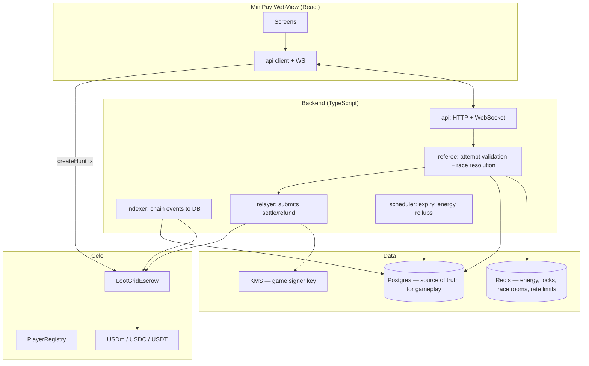
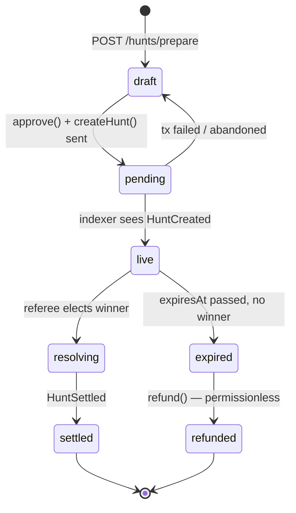

# LOOTGRID — Backend & Smart Contract Design

Status: design proposal (v1). Nothing here is implemented yet — the current app is a
client-only prototype where all state lives in `useGameState.js` and all money is fake.

This document covers the trust model, the on-chain contracts, the off-chain services, and
exactly how every gameplay state is handled across the two.

---

## 0. The one decision everything hangs off

LOOTGRID is a **real-money race**. Two or more players hunt the same tile, and the first to
crack a reflex minigame takes an escrowed prize. That single sentence rules out most naive
architectures:

| Approach | Verdict |
| --- | --- |
| **Fully on-chain** — every tile reveal and every tap is a transaction | Dead on arrival. The tap game is 14 inputs in 6 seconds. Even at sub-cent fees and 1s blocks, you cannot settle 14 txs inside the game's own timer, and the hidden grid would be world-readable. |
| **Fully client-side, contract pays whoever asks** | Anyone reads the bundle, calls the payout, drains every hunt. |
| **Off-chain authoritative referee + on-chain escrow & settlement** | ✅ Recommended. |

**The model: the chain owns the money, the server owns the game.**

The contract escrows the prize and will only release it against an EIP-712 voucher signed by
a known game-server key. The server is the referee: it holds the hidden grid, runs the clock,
validates every input, and elects the winner. The client renders and forwards input — it is
never trusted for anything.

### What this costs you, stated plainly

The game server is a trusted party. If its signing key leaks, an attacker can settle every
funded hunt to themselves. This is a real risk and it is the price of a playable real-money
reflex game. It is mitigated, not eliminated, by:

- **The contract can never pay out more than was escrowed for that specific hunt.** Blast
  radius is bounded by open TVL, not by the treasury.
- **`refund()` is permissionless and cannot be paused.** If the server disappears or turns
  malicious, every creator gets their money back after expiry without needing anyone's
  cooperation.
- **Signer rotation is behind a 48h timelock**, so a compromised key cannot be quietly
  replaced with a longer-lived one.
- **A guardian key can pause `settle()` (but never `refund()`)** for incident response.
- **Signing key lives in a KMS/HSM**, never in an env var, never on the API boxes — only the
  settlement worker can invoke it, and every invocation is logged.
- **Keep prizes small in v1** ($1–$50 as the UI already suggests). Trust assumptions should be
  proportionate to the money at stake.

Phase 3 has a path to shrink this trust further (see §11).

---

## 1. MiniPay constraints that force design decisions

These are not preferences, they are hard limits of the target wallet:

| Constraint | Consequence |
| --- | --- |
| **No message signing** | ❌ No SIWE / EIP-4361 auth. ❌ No ERC-2612 `permit`. ❌ No Permit2. Approvals must be real transactions, and session auth needs a different mechanism (§5.1). |
| **Legacy transactions only (no EIP-1559)** | All client-side writes must be sent with `type: 'legacy'`. The relayer should match. |
| **Gas payable in stablecoins (`feeCurrency`)** | A winner with zero CELO can still self-submit their own claim. This is what makes the escape hatch real rather than theoretical. |
| **Celo Mainnet + Celo Sepolia only** | Single-chain. No bridging logic, no cross-chain state. |
| **viem only, no ethers.js** | Already fine — viem on both client and server. |
| **Wallet is injected, connection is implicit** | No connect button inside MiniPay. `window.ethereum.isMiniPay === true`. |

### Token choice

The create-hunt screen currently offers `cUSD / USDT / CELO`. Recommended change:

- **USDm** (`0x765de816845861e75a25fca122bb6898b8b1282a`, **18 decimals**) — the Mento dollar,
  formerly cUSD. Default.
- **USDC** (`0xcebA9300f2b948710d2653dD7B07f33A8B32118C`, **6 decimals**)
- **USDT** (`0x48065fbbe25f71c9282ddf5e1cd6d6a887483d5e`, **6 decimals**)
- **Drop CELO.** A prize denominated in a volatile asset means the advertised "$10.00" is a
  lie by the time someone wins it. Prizes are displayed in dollars; escrow them in dollars.

⚠️ **Mixed decimals are a live bug source.** Never assume 18. Store amounts in token-native
base units everywhere (contract, DB, API), and format only at the display edge. USDT on Celo
also has a non-standard `transfer` return — use `SafeERC20`.

---

## 2. System shape



**Division of authority — memorize this line:**
the chain is the source of truth for *money*, Postgres is the source of truth for
*gameplay*, and Redis holds *hot ephemeral state* that can be rebuilt from Postgres.

---

## 3. Smart contracts

Three contracts, in descending order of how much damage a bug in each one does. Foundry, Solidity
`^0.8.24`, OpenZeppelin for `SafeERC20` / `EIP712` / `ECDSA` / `Pausable` / `ReentrancyGuard`.

| Contract | Holds | Worst case if compromised |
| --- | --- | --- |
| `PlayerRegistry` | authentication authority | impersonate every player at once |
| `LootGridEscrow` | prize funds | drain open prizes |
| `LootGridActions` | nothing | false entries in a public game log |

### 3.1 `LootGridEscrow.sol` — the only contract that holds money

One contract holding all hunts in a mapping. **Not** a contract-per-hunt — deploying a clone
for a $1 prize is absurd on gas.

```solidity
// SPDX-License-Identifier: MIT
pragma solidity ^0.8.24;

enum HuntStatus { None, Funded, Settled, Refunded }

struct Hunt {
    // slot 0
    address creator;     // 160
    uint64  expiresAt;   //  64
    HuntStatus status;   //   8
    // slot 1
    address token;       // 160
    uint96  prize;       //  96  — token-native base units
    // slot 2
    bytes32 cellCommit;  // keccak256(huntId, zoneId, r, c, salt)
    // slot 3
    address winner;
}

contract LootGridEscrow is EIP712, Pausable, ReentrancyGuard {
    mapping(bytes32 => Hunt) public hunts;

    address public gameSigner;      // referee key (KMS)
    address public pendingSigner;   // timelocked rotation
    uint64  public signerEta;
    address public guardian;        // can pause settle, never refund
    address public treasury;
    uint16  public feeBps;          // capped at 1000 (10%)

    event HuntCreated(bytes32 indexed huntId, address indexed creator,
                      address token, uint256 prize, uint64 expiresAt, bytes32 cellCommit);
    event HuntSettled(bytes32 indexed huntId, address indexed winner,
                      uint256 payout, uint256 fee, uint16 zoneId, uint8 r, uint8 c);
    event HuntRefunded(bytes32 indexed huntId, address indexed creator, uint256 amount);
}
```

`uint96` caps a single prize at ~7.9e28 base units — that is ~79 billion for an 18-decimal
token. Fine, and it packs the struct into 4 slots.

#### `createHunt`

The creator funds a hunt, but **the creator must not choose the tile** — otherwise they tell a
friend where it is and split the prize. The server picks the cell, commits to it, and
authorizes the creation.

```solidity
struct CreateAuth {
    bytes32 huntId;
    address creator;
    address token;
    uint256 prize;
    uint64  expiresAt;
    bytes32 cellCommit;
    uint64  deadline;
}

function createHunt(CreateAuth calldata a, bytes calldata serverSig)
    external whenNotPaused nonReentrant
{
    require(block.timestamp <= a.deadline, "auth expired");
    require(msg.sender == a.creator, "not creator");
    require(hunts[a.huntId].status == HuntStatus.None, "exists");
    require(a.expiresAt > block.timestamp + MIN_DURATION, "too short");
    require(_recover(_hashCreate(a), serverSig) == gameSigner, "bad server sig");
    require(allowedToken[a.token], "token not allowed");

    hunts[a.huntId] = Hunt({
        creator: a.creator, expiresAt: a.expiresAt, status: HuntStatus.Funded,
        token: a.token, prize: uint96(a.prize), cellCommit: a.cellCommit, winner: address(0)
    });

    IERC20(a.token).safeTransferFrom(msg.sender, address(this), a.prize);
    emit HuntCreated(a.huntId, a.creator, a.token, a.prize, a.expiresAt, a.cellCommit);
}
```

Requiring `serverSig` also means nobody can spam junk hunts the backend has never heard of.

> **Two transactions, unavoidable.** No `permit` in MiniPay, so the creator does
> `approve(escrow, prize)` then `createHunt(...)`. The UI must present this as a visible
> two-step ("1. Approve · 2. Lock prize"), not a spinner that mysteriously prompts twice.
> Approve the exact amount, not `MaxUint256`.

#### `settle` — pays the winner and reveals the tile

```solidity
struct Settlement {
    bytes32 huntId;
    address winner;
    uint32  elapsedMs;   // recorded for the UI / audit
    uint16  zoneId;      // ─┐
    uint8   r;           //  ├─ preimage of cellCommit
    uint8   c;           //  │
    bytes32 salt;        // ─┘
    uint64  deadline;
}

function settle(Settlement calldata s, bytes calldata serverSig)
    external whenNotPaused nonReentrant
{
    Hunt storage h = hunts[s.huntId];
    require(h.status == HuntStatus.Funded, "not funded");
    require(block.timestamp <= s.deadline, "voucher expired");
    require(block.timestamp <= h.expiresAt, "hunt expired");
    require(_recover(_hashSettle(s), serverSig) == gameSigner, "bad server sig");
    require(
        keccak256(abi.encode(s.huntId, s.zoneId, s.r, s.c, s.salt)) == h.cellCommit,
        "commit mismatch"
    );

    h.status = HuntStatus.Settled;   // CEI — state before transfer
    h.winner = s.winner;

    uint256 fee    = (uint256(h.prize) * feeBps) / 10_000;
    uint256 payout = uint256(h.prize) - fee;

    IERC20(h.token).safeTransfer(s.winner, payout);
    if (fee > 0) IERC20(h.token).safeTransfer(treasury, fee);

    emit HuntSettled(s.huntId, s.winner, payout, fee, s.zoneId, s.r, s.c);
}
```

Four properties worth calling out:

1. **Anyone may submit it.** The relayer normally does, so the winner never touches gas. But
   the voucher is *also* handed to the client — if the relayer is down, the player claims it
   themselves, paying gas in USDm via `feeCurrency`. Their money is never hostage to our uptime.
2. **Front-running is harmless.** `winner` is inside the signed payload, so a mempool watcher
   who copies the voucher can only pay gas to deliver *the rightful winner's* prize.
3. **Replay is impossible.** `status` is one-shot; the `huntId` is the nonce.
4. **The commit is verified on-chain.** Publishing `cellCommit` at creation and revealing
   `(zoneId, r, c, salt)` at settlement proves the server did not relocate the treasure to
   wherever a favoured player happened to be digging. Cheap, and it is the difference between
   "trust us" and "check us".

Short `deadline` (~5 min) so a voucher leaked from a log cannot be replayed weeks later.

#### `refund` — the escape hatch, deliberately unstoppable

```solidity
function refund(bytes32 huntId) external nonReentrant {
    Hunt storage h = hunts[huntId];
    require(h.status == HuntStatus.Funded, "not funded");
    require(block.timestamp > h.expiresAt, "not expired");

    h.status = HuntStatus.Refunded;
    IERC20(h.token).safeTransfer(h.creator, h.prize);
    emit HuntRefunded(huntId, h.creator, h.prize);
}
```

Note there is **no `whenNotPaused`** and **no server signature**. This is intentional and is
the single most important safety property in the system: if we vanish, get compromised, or
maliciously pause, every unclaimed prize still returns to whoever put it up. Do not "tidy this
up" by adding a modifier later.

#### Admin surface (small on purpose)

- `proposeSigner(address)` / `acceptSigner()` — 48h timelock between them.
- `setGuardian`, `setTreasury`, `setFeeBps` (hard-capped at 1000) — owner, behind a multisig.
- `setAllowedToken(address, bool)` — allowlist; prevents fee-on-transfer and rebasing tokens
  from breaking accounting.
- `pause()` / `unpause()` — guardian. Affects `createHunt` and `settle` only.

### 3.2 `PlayerRegistry.sol` — auth without message signing

Because MiniPay cannot sign messages, we cannot do challenge/response auth. Instead the player
does **one cheap transaction, once ever**, binding a locally-generated session key to their
address:

```solidity
contract PlayerRegistry is Initializable, Ownable2StepUpgradeable, UUPSUpgradeable {
    mapping(address => address) public sessionKeyOf;
    mapping(address => uint64)  public updatedAt;

    address public pendingImplementation;
    uint64  public upgradeEta;
    uint64  public constant UPGRADE_DELAY = 48 hours;

    event SessionKeyBound(address indexed player, address indexed sessionKey, uint64 at);
    event SessionKeyCleared(address indexed player, address indexed sessionKey, uint64 at);
    event UpgradeProposed(address indexed implementation, bytes32 codehash, bytes32 payloadHash, uint64 eta);

    function initialize(address initialOwner) external initializer;
    function bind(address sessionKey, bytes calldata sig) external;
    function clear() external;
    function isBound(address player, address sessionKey) external view returns (bool);
    function binding(address player) external view returns (address key, uint64 at);
    function proposeUpgrade(address newImplementation, bytes calldata migrationData) external onlyOwner;
}
```

The client generates a **secp256k1** keypair in `localStorage`, calls `bind(sessionKey, sig)`
once (sub-cent, gas payable in USDm), and from then on **signs every API request with the
session key** — no wallet interaction at all.

Three details that are load-bearing, all of which the shipped contract enforces:

- **The key stores an address, not a hash.** The server authenticates by recovering the signer
  of a request and comparing addresses, so a `keccak(pubkey)` hash would be unusable — there is
  nothing to compare it against. (An earlier draft of this doc specified a `bytes32` hash and
  P-256; both were wrong. P-256 is not recoverable via `ecrecover` at all.)

- **`sig` is a proof of possession**, an EIP-191 signature by `sessionKey` over
  `bindDigest(player, sessionKey)`, which commits to the chain id, the contract address and the
  player. Without it any wallet could bind a key it does not control — including one already
  bound to somebody else — so a single key could authenticate several accounts and the registry
  could not answer who actually holds a key. **The session key signs, not the wallet**, so the
  MiniPay limitation is untouched.

- **Both mutations emit the retired key.** `SessionKeyCleared(player, sessionKey, at)` fires on
  `clear()` *and* on a rotation, so a consumer watching a specific key learns when it dies. The
  server subscribes to both and drops its cache entry, which is what makes revocation take
  effect on the next request rather than at the end of a cache TTL.

Re-binding from the wallet rotates the key, which is also the "log out everywhere" button.
`clear()` reverts when nothing is bound, so `updatedAt` cannot be used to manufacture
revocation records for keys that never existed.

#### Upgradeability — and what it costs

The registry is **UUPS-upgradeable behind an ERC-1967 proxy**. This is a deliberate reversal of
the original design, which had no owner and no upgrade path precisely so that the deployer key
would be worthless. Be clear about what changed:

> **The registry owner is now the highest-value key in the system — above the escrow's game
> signer.** The registry holds no funds, but it holds *authentication authority*. An
> implementation where `isBound` returns true unconditionally is impersonation of every player
> at once. The escrow signer's worst case is bounded by open TVL; this one is not bounded by
> anything.

Three mitigations, none of which is a substitute for the others:

- **48-hour timelock.** `proposeUpgrade` starts a clock and emits `UpgradeProposed`;
  `_authorizeUpgrade` rejects any implementation that was not proposed or whose delay has not
  elapsed, and consumes the proposal so one proposal buys exactly one upgrade. A stolen owner key
  cannot swap the implementation in the transaction it is stolen. **The delay's value here is
  detection, not exit** — players have nothing to withdraw, so it is only useful if someone is
  watching `UpgradeProposed`.
- **Two-step ownership**, so the seat cannot be handed to a mistyped address.
- **`_disableInitializers()` in the constructor**, closing the classic UUPS hole where an
  attacker initializes the bare implementation.

Owner **must** be a multisig in production. Storage is append-only with a `__gap`; never reorder
or remove existing variables.

### 3.3 `LootGridActions.sol` — the public record

The escrow proves the money moved and the registry proves who you are. `LootGridActions` is the
append-only log of what happened in the game: one transaction per hunt entry and per hunt
resolution, with **no wallet prompt and no gas for the player**.

> **Tile reveals are no longer relayed (v2, phase 1).** The contract still exposes
> `recordReveal` / `recordRevealBatch` and the server never calls either. A public, per-player
> log of who uncovered which tile would let any observer reassemble the pooled map and hand it
> back to everyone — restoring free-riding, restoring the subsidy against the hint market, and
> making burner wallets cheap again. It is the one on-chain claim that private fog contradicts,
> and the weakest of them. Commitments, hint sets and their truth flags, entries, resolutions
> and payouts are all still published, and those are what the audit story actually rests on.

**Why gameplay itself cannot go on chain.** Tap Challenge is 14 inputs in 6 seconds against ~1s
blocks. Routing inputs through consensus would mean block inclusion order decides races instead of
reflexes — the fastest player loses to the one whose transaction landed earlier in the same block.
The 400ms settlement window exists precisely because latency must not be the game. So the referee
still decides, and the chain still records.

**What it costs and what it buys.**

| | |
| --- | --- |
| Storage written | none — events only |
| Gas per record | ~26k (a log, versus ~20k for a single `SSTORE`) |
| Upgradeable | no; it holds nothing worth an upgrade key |
| Who signs | the relayer, not the player |

Events only is the load-bearing choice. The server already holds authoritative state; duplicating
it on chain would cost 10–20× per action to store a second copy of a database it does not trust
less.

**The trust boundary does not move.** There is no per-action signature check, because verifying
the referee's own attestation would cost gas and prove nothing — the referee controls the hidden
grid, so a dishonest one could fabricate reveals whether or not a signature is verified. Read
these logs as *the referee's signed, timestamped claim* about what happened, not as proof the game
was fair. Proof of fairness comes from the epoch seed commitment (§5.4) and the per-hunt salt
revealed at resolution (§5.9), which is a different mechanism entirely.

Two roles, separate on purpose: `relayer` writes records and is a hot key on the VPS; `owner`
rotates the relayer and touches nothing else. A leaked relayer key can write false game logs and
nothing more, and rotation is one transaction. This is a much smaller blast radius than
`REGISTRY_OWNER`, which is why an EOA owner is acceptable here and is not there.

#### The outbox

The server never waits on the chain. `enqueue()` is a synchronous insert into a SQLite
`relay_queue` table, wrapped in a `try/catch` that swallows its own errors; a worker drains it out
of band. If the RPC is down, the key is unfunded or the chain is congested, rows accumulate and
drain later — the game does not stall, slow down, or fail. A public audit log is worth having, but
not worth one dropped race.

- **Idempotent on enqueue, at-least-once on delivery.** `dedupe_key` is derived from the game
  fact — `reveal:{zone}:{epoch}:{r}:{c}`, `entry:{hunt}:{player}` — not from the call site, so a
  crash-and-replay inside the request path cannot queue the same event twice. Both keys mirror a
  UNIQUE constraint that already exists in the game schema, so they cannot collide. The *send*
  path offers no such guarantee: a transaction that is mined but whose response is lost is retried
  under a fresh nonce and both land. **Indexers must deduplicate on event contents.** Publishing a
  duplicate beats silently losing a record.
- **Pipelined.** Nonces are tracked locally and receipts are awaited off the send path. Awaiting
  each receipt inline would cap throughput at one transaction per block.
- **Bounded.** Exponential backoff from 2s to 5 minutes; after `RELAY_MAX_ATTEMPTS` a row is
  parked as `dead` and kept for inspection, never deleted. **`lootgrid_relay_dead_total` is the
  metric to alert on** — a dead row is a game event that will never reach the chain.
- **One transaction per action.** This is now an invariant rather than a default.
  `RELAY_BATCH_SIZE` was removed with the reveal relay: `recordRevealBatch` was the only
  multi-row call the contract offers, so with reveals gone there is nothing left to group.

Ids are packed as ASCII into `bytes32` (`ridge` → `0x7269646765…`) so an explorer shows something
readable; anything over 31 bytes falls back to keccak. An indexed topic occupies a full word
regardless of declared type, so this costs exactly what a `uint16` would have and avoids
maintaining a numeric id registry.

**Off is a valid production setting.** `RELAY_ENABLED=false` by default. The chain records nothing
the server does not already own, so enabling it is a decision about public verifiability and
gas budget, not about whether the game works.

### 3.4 Testing

Foundry. Non-negotiable coverage:

- Full lifecycle per token, **including 6-decimal USDC/USDT** — decimal bugs are the likeliest
  way to overpay by 10¹².
- Fuzz `settle` against wrong signer, expired deadline, wrong commit preimage, replay, wrong
  status.
- Invariant: `sum(prize for Funded hunts) <= escrow token balance`, always.
- `refund` still works while paused.
- Reentrancy via a malicious token in the allowlist.
- Fork tests against real USDm/USDC/USDT on a Celo mainnet fork.

---

## 4. Data model (Postgres)

```
players            (address PK, handle, created_at, session_key_hash, bound_at,
                    energy_value, energy_updated_at, trust_score, shadow_banned)

zones              (id PK, name, accent, cols, rows, seed_commit, seed_revealed_at,
                    rotates_at, active)
zone_seeds         (zone_id, epoch, seed_secret, seed_commit, revealed_at)   -- seed_secret
                                                              -- withheld until rotation

tile_reveals       (zone_id, epoch, player_address, r, c, tile_type, revealed_at)
                    PK (zone_id, epoch, player_address, r, c)   -- private fog: the map
                                                                -- is per player, not per zone

hunts              (id PK uuid/bytes32, zone_id, epoch, r, c, salt, cell_commit,
                    kind ENUM(cash,puzzle), creator_address, token, prize_base_units,
                    difficulty, expires_at,
                    chain_status ENUM(pending,funded,settled,refunded),
                    game_status  ENUM(draft,live,resolving,resolved,expired),
                    winner_address, create_tx, settle_tx, created_at)
                    UNIQUE (zone_id, epoch, r, c)

attempts           (id PK, hunt_id, player_address, game_type, seed,
                    spec jsonb, started_at, deadline_at,
                    status ENUM(active,won,lost,failed,abandoned),
                    elapsed_ms, progress_pct, finished_at)
                    UNIQUE (hunt_id, player_address)          -- one attempt per player

attempt_events     (attempt_id, seq, kind, payload jsonb, t_client_ms, t_server_ms)
                    -- append-only input log; the anti-cheat audit trail

settlements        (hunt_id PK, winner_address, voucher jsonb, signature,
                    relay_status ENUM(queued,sent,mined,failed), tx_hash, attempts_count)

energy_ledger      (player_address, delta, reason, ref_id, at)  -- audit; balance is on players
idempotency_keys   (key PK, player_address, endpoint, response jsonb, at)
leaderboard_daily  (day, player_address, won_base_units, finds)  -- rollup from HuntSettled
```

Two indexes that matter: `attempts(hunt_id, status)` for race resolution, and
`hunts(game_status, expires_at)` for the expiry sweeper.

---

## 5. Gameplay states — end to end

This is the core of the design: every state the current `useGameState.js` holds, and where it
actually lives once there is a backend.

### 5.1 App open → session

```
1. Client detects window.ethereum.isMiniPay, calls eth_requestAccounts → address (implicit).
2. Client looks for a session keypair in localStorage.
   - Missing, or PlayerRegistry.sessionKeyOf(address) does not match:
       → prompt the one-time bind() transaction ("Set up your hunter profile").
   - Present and matching:
       → POST /session { address, sig(session key over nonce) } → short-lived JWT.
3. GET /me → { handle, energy, energyMax, balances, stats }
```

Energy, balance and stats are **server-computed**. The client never initializes them.

### 5.2 Energy — the resource that gates everything

Currently a `setInterval` incrementing client state; anyone with devtools has infinite energy.

Server-side, energy is **lazily computed, never ticked**:

```ts
const REGEN_MS = 9_000, MAX = 12;

function currentEnergy(p: Player, now: number) {
  const regen = Math.floor((now - p.energy_updated_at) / REGEN_MS);
  return Math.min(MAX, p.energy_value + regen);
}
```

Spending must be atomic or double-tap becomes free energy. A Redis Lua script does
compute-then-decrement in one round trip:

```lua
-- KEYS[1] = energy:{address}   ARGV = now, cost, regenMs, max
local v, t = tonumber(...), tonumber(...)
local cur = math.min(max, v + math.floor((now - t) / regenMs))
if cur < cost then return -1 end
redis.call('HSET', KEYS[1], 'v', cur - cost, 't', now)
return cur - cost
```

Postgres is written through asynchronously; Redis is authoritative for the hot path and
rebuildable from `energy_ledger`. Every action response carries the authoritative
`{ energy, energyMax, nextRegenMs }` so the UI corrects itself continuously and drift is
impossible.

### 5.3 Zone list

`GET /zones` → live aggregates computed from `hunts` (open cash prize sum, distinct active
hunters in the last 5 min, hunt counts). The current hardcoded `ZONES` array becomes seed data
for the row's cosmetic fields only; every number on the card is derived.

⚠️ **All four zones currently render the identical grid.** Zones must become real: separate
`(zone_id, epoch)` namespaces with independent seeds, hunt sets, and reveal state.

### 5.4 Entering a zone — the fog

The critical fix: **`hiddenType(r, c)` currently ships in the client bundle.** Anyone can read
`gameData.js` and compute the entire map, including every treasure location. The fog is
decorative today.

Server-side:

```ts
tileType(zoneSeed, r, c) = bucket(keccak256(zoneSeed ‖ r ‖ c))
// zoneSeed is secret for the life of the epoch
```

`GET /zones/:id/grid` is **authenticated**, and returns **only the cells the calling player has
revealed** — `{ r, c, type, prize?, byHandle }` — plus the positions of *live hunts*, which are
public by design (the fireworks tile is the whole point). Unrevealed cells are simply absent
from the payload; the client renders fog for anything it wasn't told about.

> **The fog is private (v2, phase 1).** Everyone hunts the same treasure in the same zone, but
> what you have personally uncovered, only you see. `reveals` is keyed
> `(zone_id, epoch, player_id, r, c)`. This is the single change that stops a zone being
> *consumed* — under a shared map its remaining life fell as players arrived — and it is what
> ends free-riding, ends the standing subsidy against the hint market (every shared dig was a
> free hint about where treasure was *not*), and makes fifty burner wallets cost fifty times
> the energy instead of sharing one solved map. There is no longer any such thing as "the
> zone's map" to serve anonymously.

**Provable fairness:** publish `seed_commit = keccak256(zoneSeed)` when the epoch opens, and
reveal `zoneSeed` when the epoch rotates. Players can then verify after the fact that the map
was fixed in advance and not rewritten under them. Epoch rotation is live as of v2 phase 1 —
maps reprint on a per-zone schedule (`zones.rotates_at`, default three days, staggered so the
world never resets all at once), and the outgoing secret is archived to `zone_seed_history`
before it is overwritten.

### 5.5 Tapping a fog tile

```
POST /zones/:id/tiles/:r/:c/open      Idempotency-Key: <uuid>
```

Server, in order:

1. Verify session; check `shadow_banned`.
2. Rate limit (Redis token bucket — ~5 opens/sec ceiling; a human cannot beat that meaningfully).
3. Atomic energy decrement of 1 → `-1` means insufficient, return `409 INSUFFICIENT_ENERGY`
   (this drives the existing `OUT OF ENERGY — REGENERATING` toast).
4. `INSERT ... ON CONFLICT DO NOTHING` into `reveals` — a conflict now means only that *this
   same player* already opened this tile (a double-tap or a retried request); **refund the
   energy** and return the existing cell. Under private fog there is no race with another
   player to lose.
5. Compute `tileType` from the secret seed, persist.
6. Send `tile:revealed` **to the opening player alone**, never to the zone room. Broadcasting
   it was the free-riding leak in socket form.
7. Return `{ cell, energy }`.

Note what is **not** in this list any more: a dig is no longer relayed on chain. See §the relay
outbox — a public per-player reveal log would republish the very map private fog withholds.

The `-1⚡` float animation stays purely client-side, fired on the optimistic tap and reconciled
against the server's energy value in the response.

### 5.6 Tapping a hunt tile → preview

`GET /hunts/:id` → prize, token, creator handle, **live chasers count** (real, from Redis
presence, not the hardcoded `beat` field), energy cost, and `canAfford`. Read-only, no state
change. The preview sheet must reflect that a hunt may already be `resolved` — someone can win
it while the sheet is open, and the WS `hunt:resolved` event should close it with "already
cracked".

### 5.7 Confirming a hunt → attempt starts

`POST /hunts/:id/attempts` is where the money-relevant clock starts.

1. Assert `hunt.game_status = 'live'` and `chain_status = 'funded'` — never let anyone play for
   a prize that isn't actually escrowed on-chain.
2. Atomic energy decrement (3 for cash, 2 for puzzle).
3. Reject a second attempt by the same player on the same hunt (`UNIQUE (hunt_id, player)`).
   One shot each — otherwise retries beat reflexes.
4. **Server** picks the game type from a per-attempt seed. Keep the current mapping's spirit but
   move the decision server-side:
   - cash hunts → `tap` | `math` | `sequence`
   - puzzle hunts → `memory`
5. Generate the spec, persist the attempt with `started_at` and `deadline_at`, join the player
   to the `hunt:{id}` WS room, return the spec.

`started_at` is stamped **when the server sends the spec**, and elapsed time is measured
server-side from that instant. This is deliberate: scoring by elapsed-since-spec rather than by
absolute arrival time neutralizes ping asymmetry to first order, so a player on a weak
connection in Lagos is not structurally beaten by someone on fibre.

### 5.8 The four minigames — what the server validates

**The uncomfortable truth first:** for a memory or math game the client necessarily knows
enough to solve it instantly. Secrecy is not available. **Timing plausibility is the entire
defense**, backed by longitudinal anomaly detection. Design accordingly, and size prizes to
match.

Every input is sent as an event with a client timestamp, and the server records its own receive
time into `attempt_events`. Validation is over the server's timeline; client timestamps are used
only to detect *inconsistency*.

#### Tap — mash to 14 within 6s

Spec: `{ type:'tap', target:14, durationMs:6000 }`

- Total elapsed ≤ `6000 + latencyGrace(400ms)`.
- Count ≥ target.
- Min inter-tap interval ≥ **25ms** (the human tapping record is ~15/sec ≈ 66ms; 25ms is
  generous and still rejects scripted bursts).
- **Interval standard deviation > 8ms.** A bot firing on a fixed timer has near-zero variance;
  human tapping is inherently jittery. This is the highest-signal check in the whole system.
- ≥ 3 distinct interval values.

Client batches taps every ~200ms rather than one message per tap — 14 WS frames per player per
race, times every concurrent hunt, is needless load.

#### Memory — 4-pad Simon

Spec: `{ type:'memory', sequence:[...], playbackEndsAt }` — the sequence *must* be sent to be
rendered, so the client knows the answer.

- No input accepted before `playbackEndsAt`.
- Order matches exactly.
- Inter-press ≥ **120ms** (human recall/motor floor).

**Recommendation: keep memory on XP puzzles only, never on cash hunts.** It is the weakest of
the four against automation. The current code already routes puzzle cells to `startMemory` — that
was the right instinct, and it should become an enforced invariant rather than an accident.

#### Math — 3 correct in a row

- **Server generates each question and never sends the answer.** The client receives the four
  options; the server knows which is correct.
- **Questions are issued sequentially** — question N+1 is only sent after N is answered
  correctly. This forces a real round trip per question and makes the measured time include
  network reality rather than a precomputed batch.
- Per-answer time ≥ **300ms** (reading `7 × 8` and four options takes at least that) and ≤ 8s.
- Wrong answer → attempt `failed` immediately.

#### Sequence — tap 1→5 in order

- Server generates the shuffled layout and positions.
- Order strictly ascending; first wrong tap → `failed`.
- Inter-tap ≥ **90ms**.

#### Progress broadcasting

After each validated input the referee publishes to the `hunt:{id}` room:

```json
{ "t": "progress", "player": "@maya", "pct": 43 }
```

throttled to ~5Hz.

> ⚠️ **This replaces the fake rivals, and that is not a cosmetic change.**
> `startRivals()` currently invents 2–3 bots that fill progress bars on a 280ms timer, and when
> one hits 100% **the player loses a real-money race to a simulation**. Once actual funds are
> escrowed that is not a game-feel flourish, it is taking a user's stake with a rigged
> opponent — indefensible commercially and legally. Rival bars must show only real concurrent
> humans. **If nobody else is hunting the tile, show no bars at all** (or an explicit "you're
> alone on this one" — which is a genuinely nice feeling to give a player).

### 5.9 Race resolution — electing exactly one winner

The naive approach — first completion to hit Redis `SET NX` wins — gives the prize to whoever
has the best network, not the fastest hands. Instead:

```mermaid
sequenceDiagram
    participant A as Player A
    participant B as Player B
    participant R as Referee
    participant Rd as Redis
    participant Rl as Relayer
    participant C as LootGridEscrow

    A->>R: final input (validates, elapsed 3100ms)
    R->>Rd: SET hunt:{id}:window NX PX 400
    Note over R: first valid completion opens<br/>a 400ms settlement window
    B->>R: final input (validates, elapsed 2980ms)
    R->>Rd: ZADD hunt:{id}:finishers 2980 B
    Note over R: window closes
    R->>R: winner = lowest elapsed_ms<br/>tie-break: earlier started_at, then hash
    R->>Rd: SET hunt:{id}:winner NX B
    R->>R: attempts: B=won, A=lost; hunt=resolving
    R-->>A: hunt:resolved { winner:"@B", elapsedMs:2980 }
    R-->>B: attempt:won { voucher, signature }
    R->>Rl: enqueue settle
    Rl->>C: settle(voucher, sig)  [legacy tx]
    C-->>Rl: HuntSettled
    Rl-->>B: win:confirmed { txHash, payout }
```

A **400ms settlement window** is imperceptible to players and neutralizes most latency
asymmetry. Winner is the lowest *server-measured elapsed time*, not the first packet to arrive.
Ties break on earlier `started_at`, then on `keccak(huntId ‖ address)` for determinism.

Everyone else in the room gets `hunt:resolved` — **this is the event that finally drives the
"@maya GOT THERE FIRST" screen**, which today is dead code (`useGameState.js:165` sets
`showMinigame: false` in the same patch as `lostTo`, unmounting the overlay before it can
render).

### 5.10 Winning → settlement → the real tx hash

1. Referee builds the `Settlement` struct, signs EIP-712 via KMS.
2. Voucher + signature are **pushed to the winner's client immediately** — the win screen can
   render instantly with `status: 'settling'` rather than waiting on a block.
3. Relayer job submits `settle()` as a **legacy** tx from a nonce-managed hot wallet, retrying
   with bumped gas; failures alert and stay queued.
4. Indexer observes `HuntSettled`, marks `hunts.chain_status = 'settled'`, records `settle_tx`,
   updates the leaderboard rollup, pushes `win:confirmed { txHash }`.
5. Win screen swaps to the **real** Celoscan-linkable hash — replacing
   `'0x' + Math.random().toString(16).slice(2,8)`.

If the relayer is stuck > 60s, the UI surfaces "Claim it yourself" and the client submits the
same voucher directly with `feeCurrency: USDm`. **The player's money is never hostage to our
infrastructure.**

### 5.11 Losing and failing

Three distinct end states the current UI conflates:

| State | Cause | Energy | UI |
| --- | --- | --- | --- |
| `lost` | Another human resolved it first | spent, gone | "@x GOT THERE FIRST" + back to grid |
| `failed` | Timer expired / wrong answer / wrong order | spent, gone | "TOO SLOW" / "WRONG ORDER" + back to grid |
| `abandoned` | Disconnected past `deadline_at` | spent, gone | resumable until deadline, then failed |

> 🐛 **Fix this in the client regardless of backend timing.** On `mgFail` nothing sets
> `showMinigame: false` and the overlay has no close control — the player is **soft-locked**
> with no route back to the grid. With real money spent on entry that turns a lost hunt into a
> dead app.

Attempts are server-owned, so a mid-game disconnect doesn't void the attempt: it runs to its
deadline, and `GET /attempts/:id` on reconnect returns enough state to resume. Killing the app
to dodge a loss must not work.

### 5.12 Creating a hunt



`POST /hunts/prepare { zoneId, token, amount, difficulty, duration }`:

- Server picks a **free, unrevealed cell** in the zone (weighted by difficulty — harder hunts
  further from revealed territory), generates `salt`, computes `cellCommit`.
- Persists a `draft` hunt, returns `huntId`, `cellCommit`, the signed `CreateAuth`, and calldata
  for both txs.
- Client sends `approve` then `createHunt` (legacy, `feeCurrency: USDm`).
- Indexer sees `HuntCreated`, **verifies the emitted `cellCommit` matches the stored
  `(zoneId, r, c, salt)`**, flips to `live`, broadcasts `hunt:created` to the zone room so the
  tile lights up for everyone in real time.

The creator is never told where their hunt landed. That must be stated in the UI — it is a
fairness feature, not an omission.

Drafts expire after ~15 min and free the cell.

### 5.13 Expiry and refunds

Scheduler sweeps `hunts WHERE game_status='live' AND expires_at < now()` → mark `expired`,
enqueue `refund(huntId)` on the relayer, notify the creator. Because `refund` is permissionless,
the creator can also self-serve from the UI at any point after expiry — and should be shown a
button that does exactly that.

### 5.14 Leaderboard and profile

Both derive from **on-chain `HuntSettled` events**, not from app state, so every number is
independently verifiable on Celoscan.

- `leaderboard_daily` rolls up on each settlement; Redis caches the top 100 per window.
- Daily = trailing 24h; all-time = full history.
- Profile stats (`finds`, `won`, `xp solves`) come from `tile_reveals` + settlements.
- Balance is a live `balanceOf` read against the player's address — not a number we track.

---

## 6. API surface

**HTTP** (all mutations take `Idempotency-Key`):

```
POST   /session                          session key → JWT
GET    /me
GET    /zones
GET    /zones/:id/grid                   revealed cells + live hunts
POST   /zones/:id/tiles/:r/:c/open       −1⚡
GET    /hunts/:id
POST   /hunts/:id/attempts               −3⚡ / −2⚡, returns game spec
POST   /attempts/:id/events              batched inputs
GET    /attempts/:id                     resume after reconnect
POST   /hunts/prepare                    → huntId + CreateAuth + calldata
GET    /hunts/mine
GET    /leaderboard?window=daily|all
GET    /players/:address
GET    /audit/zones/:id/:epoch           revealed seed, post-rotation
```

**WebSocket** rooms: `zone:{id}`, `hunt:{id}`, `player:{address}`

```
← tile:revealed   { r, c, type, byHandle }
← hunt:created    { huntId, r, c, prize, token }
← hunt:chasers    { huntId, count }
← progress        { player, pct }
← hunt:resolved   { huntId, winner, elapsedMs }
← attempt:won     { voucher, signature }
← win:confirmed   { txHash, payout }
← energy          { value, max, nextRegenMs }
→ attempt:input   { attemptId, events[] }
```

---

## 7. Anti-cheat, honestly

Layered, because no single layer holds:

1. **Nothing secret in the client.** Grid seed, tile types, math answers — server-side only.
2. **Timing plausibility** per game (§5.8). Interval variance is the strongest single signal.
3. **Rate limits** per player and per IP, Redis token buckets.
4. **Longitudinal trust scoring** — win rate vs. cohort, timing-distribution tightness,
   completion times clustered near physical floors. Low scores route to a manual review queue.
5. **Shadow-ban** rather than hard block: flagged accounts keep playing but stop matching into
   cash hunts. Removes the feedback signal an attacker needs to iterate.
6. **Prize caps in v1** and escalating verification above a threshold.

**Set expectations honestly with yourself:** a determined bot author *will* beat a reflex game.
The goal is to make automation more expensive than the expected value of the prizes, not to
achieve perfect integrity. Keep prizes small, take a modest rake, and monitor.

---

## 8. Failure modes

| Failure | Handling |
| --- | --- |
| Relayer down | Voucher already on the client → user self-claims with `feeCurrency`. |
| Server down mid-hunt | Attempt expires; hunt expires; `refund()` is permissionless. Nobody's funds are stuck. |
| Chain reorg | Indexer waits 2 confirmations before marking final. Celo's finality is fast. |
| Redis flush | Energy/locks rebuild from Postgres; in-flight attempts fail closed and refund energy. |
| Signer key compromise | Guardian pauses `settle`; timelocked rotation; `refund` unaffected. |
| Two winners race | Impossible on-chain — `status` is one-shot; the second `settle` reverts. |
| Player disconnects mid-attempt | Attempt runs to `deadline_at`, resumable on reconnect. |
| Duplicate tile open | `ON CONFLICT DO NOTHING` + energy refund. |

---

## 9. Stack

- **Runtime**: TypeScript / Node 20, Fastify, `ws`. Shared types package with the React client.
- **DB**: Postgres 16 + Drizzle. Redis 7.
- **Jobs**: BullMQ (relay, expiry sweep, rollups, trust scoring).
- **Chain**: viem — `watchContractEvent` for the indexer, legacy txs for the relayer.
- **Keys**: GCP KMS / AWS KMS for the game signer. Relayer hot wallet holds gas only.
- **Contracts**: Foundry, OpenZeppelin.
- **Obs**: OpenTelemetry; alert on relay failures, settlement latency, trust-score anomalies,
  and escrow-balance-vs-open-prizes invariant drift.

---

## 10. Build order

**Phase 1 — make the existing game honest (no money).**
Backend with auth, energy, server-side fog, real hunts as XP-only, real multiplayer races over
WS, real rival bars. Ship the client fixes: the `mgFail` soft-lock, the unreachable loss screen,
and pulling `hiddenType` out of the bundle. *This is playable and valuable on its own, and it
de-risks everything below.*

**Phase 2 — money on testnet.**
`LootGridEscrow` + `PlayerRegistry` on Celo Sepolia. Indexer, relayer, voucher settlement,
create-hunt flow, refunds. Test inside MiniPay via ngrok with Developer Mode + testnet enabled.

`LootGridActions` can ship any time after `PlayerRegistry`, independently of the escrow — it
needs real addresses (`AUTH_MODE=chain`) and nothing else. Turning it on early is a cheap way to
exercise the relayer key, gas budgeting and the outbox under real load, well before any of that
sits in front of actual prize money.

**Phase 3 — mainnet.**
Audit before real funds. Prize caps, guardian + multisig, monitoring, trust scoring, the
self-claim escape hatch, published fairness audit feed (seed commits and reveals).

---

## 11. Reducing the trust assumption later

Not v1, but worth designing toward:

- **Threshold signing** — 2-of-3 referee nodes must agree before a voucher is valid, so one
  compromised box cannot settle.
- **Publish the input log.** Post `keccak(attempt_events)` per settlement and expose the raw
  log. Anyone can replay the validation and check the right player won.
- **Optimistic settlement with a challenge window** — settle immediately but allow a bonded
  challenge for N minutes; a proven bad settlement slashes the operator bond.

---

## 12. Open questions

1. **Prize cap for v1?** Suggest $50, matching the existing UI chips.
2. **Rake?** `feeBps` exists; suggest 0% at launch, 2–5% once liquidity is real.
3. **Where do puzzle-hunt XP rewards come from?** They cost the creator nothing today. Are they
   platform-funded, or is XP purely a vanity ladder?
4. **Can creators also hunt?** They don't know their own tile location, so it's technically
   safe — but it needs a stated policy.
5. **Energy monetization** — regen only, or purchasable? Purchasable energy in a real-money
   race has gambling-adjacent regulatory implications worth legal review before building.
6. **Jurisdictions.** Pre-funded prize + skill-based race is generally *not* gambling, but
   "generally" is doing heavy lifting across MiniPay's Global South markets. Get an opinion
   before mainnet.
7. **Handles** — self-chosen and unique, or derived from MiniPay's phone-number mapping?
